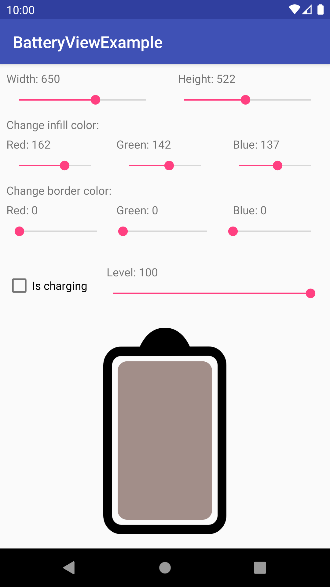
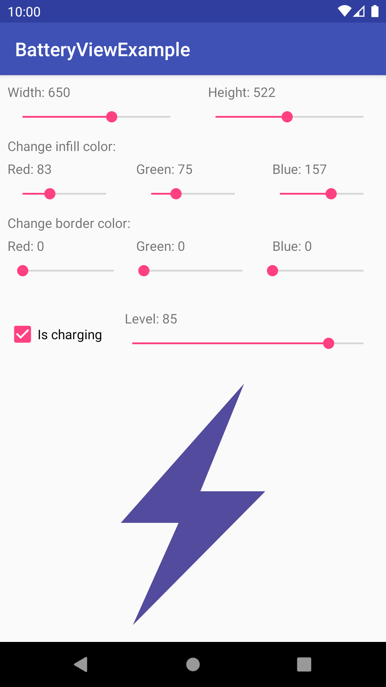
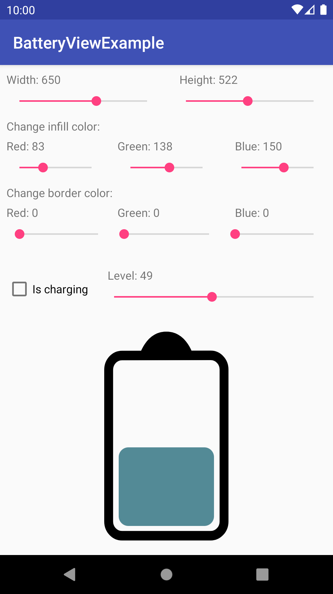

# battery-view-android

Simple View to show battery level. View scales perfectly inside bounds whatever they are, so it looks always beautiful. View can be customized. Except bounds and color can be changed: charging status - is charging or not, border thickness, spacing between border and battery-level rect and sure battery level percent. If need something else you can just leave feature request. Screenshots how it looks like:

Charged             |  Charging          |  Discharged a bit
:-------------------------:|:-------------------------:|:-------------------------:
   |   |  
##

Also you can set attributes in xml:
attribute             |  meaning
:-------------------------:|:-------------------------:
```app:bv_color``` | has 'color' type and sets the color of view
```app:bv_percent``` | has 'integer' type sets the percent of battery
```app:bv_charging``` | has 'boolean' type sets the charging state. If battery is 'charging' level rect is not shown
##
You can add this lib in your project as simple as add this line to your build.gradle file

Appcompat
```
   implementation 'iam.thevoid.batteryview:batteryview:0.1'
```

Android X
```
   implementation 'iam.thevoid.batteryview:batteryview:0.5.5'
```

[Library at Bintray](https://bintray.com/iamthevoid/maven/BatteryView)
